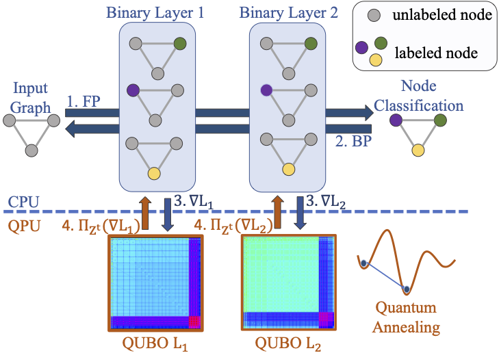

# QP-SBGD: Projected Stochastic Gradient Descent with Quantum Annealed Binary Gradients (BMVC 2024)
[Maximilian Krahn<sup>1,2</sup>](https://scholar.google.com/citations?user=Dg5q7-QAAAAJ&hl=de), [Michele Sasdelli<sup>3</sup>](https://researchers.adelaide.edu.au/profile/michele.sasdelli), [Fengyi Yang<sup>3</sup>](https://au.linkedin.com/in/frances-fengyi-yang), [Vladislav Golyanik<sup>4</sup>](https://people.mpi-inf.mpg.de/~golyanik/), [Juho Kannala<sup>1</sup>](https://users.aalto.fi/~kannalj1/), [Tat-Jun Chin<sup>3</sup>](https://researchers.adelaide.edu.au/profile/tat-jun.chin) and [Tolga Birdal<sup>2</sup>](https://profiles.imperial.ac.uk/t.birdal)

 <sup> 1 </sup> Aalto University , <sup>2</sup>Imperial College London, <sup>3</sup> Adelaide University, <sup>4</sup> Max Plank Institute for Informatics.

This is the official repository for the project "Projected Stochastic Gradient Descent with Quantum Annealed Binary Gradients".
In this work, we train binary neural networks with a quantum annealer deployable optimiser.
The preprint can be found at https://arxiv.org/abs/2310.15128 and the project page can be found [here](https://qpsbgd.github.io).
The code can be executed with [PyTorch](https://pytorch.org/) and the [D-Wave ocean sdk](https://docs.ocean.dwavesys.com/en/stable/). 
To run the code without a quantum annealer one can use [D-Wave neal](https://docs.ocean.dwavesys.com/projects/neal/en/latest/) instead of a QPU Sampler or look at the experiments with gurobi.




[](https://arxiv.org/abs/2310.15128)


## Getting Started
- The repository can be cloned with <br/>
`git clone https://github.com/mk2510/QPSBGD/` <br/>
-We recommend the user to set up a conda environment with
```
conda create --name QPSBGD --file requirements.txt
```
- The [D-Wave ocean sdk](https://docs.ocean.dwavesys.com/en/stable/) can be installed with <br/>
`python -m pip install dwave-ocean-sdk` <br/> 
and following the steps from [https://docs.ocean.dwavesys.com/en/stable/overview/install.html](https://docs.ocean.dwavesys.com/en/stable/overview/install.html). In particular to 
get access to the solvers from D-Wave one has to create an account for D-Wave Leap ([https://cloud.dwavesys.com/leap/login/?next=/leap/](https://cloud.dwavesys.com/leap/login/?next=/leap/)) and
can then use the API Token ([https://docs.ocean.dwavesys.com/en/stable/overview/sapi.html](https://docs.ocean.dwavesys.com/en/stable/overview/sapi.html)). We tested the code for dwave-ocean-sdk versions 4.2 and 6.3. 

- Installing [Gurobi](https://www.gurobi.com/) is another prerequisite. Please refer to the homepage to aquire a license.


### 10 Layer MLP - Adult Dataset
To reproduce the experiments of the paper it is required to download the datasets:


- `wget https://www.csie.ntu.edu.tw/~cjlin/libsvmtools/datasets/binary/a1a`
- `wget https://www.csie.ntu.edu.tw/~cjlin/libsvmtools/datasets/binary/a1a`

place those files in the folder `datafolder`.

The experiments are then executed by running the `10layers.ipynb` file.

### 2 Layer MLP DWave

To reproduce the experiments of the paper it is required to download the datasets:


- `wget https://www.csie.ntu.edu.tw/~cjlin/libsvmtools/datasets/binary/a1a`
- `wget https://www.csie.ntu.edu.tw/~cjlin/libsvmtools/datasets/binary/a1a`

place those files in the folder `datafolder`.

The experiments are then executed by running the `2layers.ipynb` file.


## License
Shield: [![CC BY-NC-SA 4.0][cc-by-nc-sa-shield]][cc-by-nc-sa]

This work is licensed under a
[Creative Commons Attribution-NonCommercial-ShareAlike 4.0 International License][cc-by-nc-sa].

[![CC BY-NC-SA 4.0][cc-by-nc-sa-image]][cc-by-nc-sa]

[cc-by-nc-sa]: http://creativecommons.org/licenses/by-nc-sa/4.0/
[cc-by-nc-sa-image]: https://licensebuttons.net/l/by-nc-sa/4.0/88x31.png
[cc-by-nc-sa-shield]: https://img.shields.io/badge/License-CC%20BY--NC--SA%204.0-lightgrey.svg
